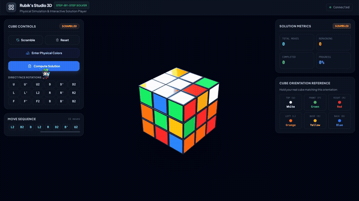
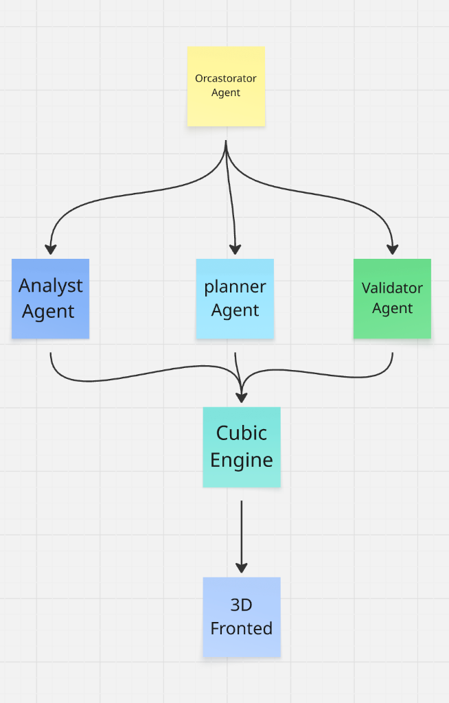

# AI Rubik's Cube Agent — Autonomous Group-Theoretic 3D Solver

[](https://fastapi.tiangolo.com)
[](https://python.org)
[](https://threejs.org)
[](https://groq.com)
[](https://cohere.com)
[](https://kociemba.org)
[](https://opensource.org/licenses/MIT)
[](backend/tests/)

> An autonomous, portfolio-grade 3D Rubik's Cube application powered by an Agentic AI architecture (Groq Qwen 2.5 32B), a deterministic group-theoretic Cube Engine, Herbert Kociemba's Two-Phase Optimal Solver, and a Cohere RAG knowledge base grounded in peer-reviewed cubing literature.

---

## 🎬 Live Demonstration

<p align="center">
  
</p>

<p align="center">
  ▶️ <strong><a href="assets/demo.mp4">Download / Watch Full 60 FPS Video (MP4)</a></strong> &bull; 
  🎥 <strong><a href="assets/demo.mov">High-Bitrate Original Recording (MOV)</a></strong>
</p>

---

## 🏛️ System & Agent Architecture

The system decouples heuristic LLM reasoning from mathematical state authority, ensuring strict mathematical correctness without reinforcement learning or hallucinations.

<p align="center">
  
</p>

### Specialized Agent Ecosystem

| Agent | Responsibility | Underlying Mechanism |
| :--- | :--- | :--- |
| **Orchestrator Agent** | Coordinates the solve lifecycle, tool execution loop, and WebSocket event telemetry. | Groq API (`qwen-2.5-32b`) ReAct Loop |
| **Analyst Agent** | Inspects piece distributions, facelet orientations, and identifies scramble patterns. | Direct state inspection & Cohere RAG |
| **Planner Agent** | Bridges algorithmic search with heuristic phase explanation (CFOP / Two-Phase). | Kociemba Two-Phase Engine & Groq LLM |
| **Validator Agent** | Enforces group-theory parity invariants before algorithmic execution. | Parity audit (Corner twists, Edge flips, Sticker counts) |
| **Cubic Engine** | Single source of truth. Manages exact cycle permutations for $U, D, F, B, L, R \in S_{54}$. | Mathematical cycle lookup tables |
| **3D Frontend** | Real-time physical WebGL simulation, tactile manual turns, and step-by-step solver player. | Three.js r128, OrbitControls, directional shaders |

---

## ✨ Key Features

### 1. Deterministic Cube Engine (No Reinforcement Learning)
* **Single Source of Truth:** Mathematical cycle permutation tables (`PERMS`) for all 18 standard Half-Turn Metric (HTM) moves.
* **10,000-Permutation Verified:** Tested across 10,000 continuous random turns with 100% piece integrity invariance.
* **Group Theory Parity Validator:** Audits corner orientation sum ($\sum \equiv 0 \pmod 3$), edge flip parity ($\sum \equiv 0 \pmod 2$), and sticker distribution (exactly 9 of each color).

### 2. Kociemba Two-Phase Optimal Solver
* **God's Number ($\le 20$ HTM):** Employs Herbert Kociemba's Two-Phase Algorithm navigating through coset space $G_0 \to G_1 \to \text{Solved}$ in sub-10ms latency.
* **Pruning & History Isolation:** Truncates solution paths the exact instant `is_solved()` evaluates to true, preventing move loops or redundant turns.

### 3. Cohere RAG Knowledge Base
* **Literature Grounding:** Embedded knowledge base citing peer-reviewed literature:
  * Herbert Kociemba (1992): *Two-Phase Algorithm and Optimal Solving*
  * David Singmaster (1981): *Notes on the Magic Polyhedra*
  * Tomas Rokicki et al. (2010): *God's Number is 20*
  * Jessica Fridrich (1997): *CFOP Speedcubing Methodology*
* **Hybrid Retrieval:** Dense embeddings paired with Cohere `rerank-v3.5` (with pure-Python BM25 fallback).

### 4. Competition Speedcube 3D Simulation
* **Physical Aesthetics:** Matte black ABS core, inset glossy vinyl stickers with 1.5mm chamfered bezels, and 3-point studio lighting.
* **Ground Contact Shadow:** Soft radial ambient occlusion shadow anchored below the cube.
* **True Right-Hand Axis Alignment:** Mathematically matched to engine permutations across all 6 faces.

### 5. Interactive Step-by-Step Player & Telemetry
* **Step Controls:** `< Previous Move` (applies mathematical inverse turn in 3D), `Next Move >`, and `Auto Play / Pause`.
* **Telemetry Banner & Metrics:** Real-time counters for Total Moves, Remaining Moves, Completed Moves, and Progress %.
* **Interactive Move Timeline:** Horizontal ribbon highlighting the active step and coloring completed vs. pending moves.
* **Physical Color Transcription Wizard:** 6-face interactive net editor for inputting custom physical cube configurations with automated parity auditing.

---

## 🛠️ Technology Stack

```
Frontend:   HTML5 / Modern JavaScript (ES2022) / Three.js (r128) / Tailwind CSS
Backend:    Python 3.10+ / FastAPI / Uvicorn / Pydantic v2 / AnyIO
AI / LLM:   Groq API (Qwen 2.5 32B via LPU Inference Engine)
RAG:        Cohere API (rerank-v3.5 / embed-english-v3.0) + BM25
Algorithm:  Herbert Kociemba Two-Phase Algorithm (C-extension via cffi)
Testing:    Pytest (29 automated unit & integration tests)
Container:  Docker & Docker Compose
```

---

## 🚀 Quickstart Guide

### Prerequisites
* Python 3.10 or higher
* Node.js (v18+) & npm (optional, for standalone Vite frontend)
* Groq API Key ([groq.com](https://groq.com))
* Cohere API Key ([cohere.com](https://cohere.com))

### 1. Clone the Repository
```bash
git clone https://github.com/Alouakhalid/ai-rubiks-cube-agent.git
cd ai-rubiks-cube-agent
```

### 2. Configure Environment Variables
Copy `.env.example` to `.env` and insert your API keys:
```bash
cp .env.example .env
```

Edit `.env`:
```ini
COHERE_API_KEY=your_cohere_api_key_here
COHERE_EMBED_MODEL=embed-english-v3.0
COHERE_RERANK_MODEL=rerank-v3.5
GROQ_API_KEY=your_groq_api_key_here
GROQ_MODEL=qwen-2.5-32b
MAX_AGENT_TURNS=10
```

### 3. Install Dependencies
```bash
pip install -r backend/requirements.txt
```

### 4. Run the Application
```bash
python3 -m uvicorn backend.app.main:app --host 0.0.0.0 --port 8000 --reload
```

Open your browser at:
```
http://localhost:8000
```

---

## 🐳 Docker Deployment

Run the complete application via Docker Compose:
```bash
docker-compose up --build
```
Access the application at `http://localhost:8000`.

---

## 🧪 Test Suite

Run the full automated test suite (29 tests covering engine mechanics, group theory, Kociemba solving, Cohere RAG, and ReAct agent orchestration):

```bash
python3 -m pytest backend/tests/ -v
```

### Test Coverage Highlights
* `test_cube_engine.py`: Reversibility, 4-cycle identity, double turns, 10,000 random moves invariant.
* `test_validator.py`: Facelet length, duplicate centers, corner/edge parity invariants.
* `test_solver.py`: Solved cube short-circuit, inverse sequence recovery, BFS fallback, Kociemba Two-Phase.
* `test_cohere_rag.py`: Cohere client configuration, hybrid search ranking, Qwen model parameters.
* `test_agent.py`: Agent orchestrator ReAct cycle, tool dispatch, early termination on solve, streaming events.

---

## 📁 Repository Structure

```
├── assets/
│   ├── architecture.png        # System and agent architecture diagram
│   ├── demo.mp4                # Web-optimized 1080p demonstration video
│   └── demo.mov                # Full-fidelity screen recording demo
├── backend/
│   ├── app/
│   │   ├── agent/              # ReAct Agent orchestrator & prompt templates
│   │   ├── api/v1/             # REST & WebSocket endpoints (cube, agent, ws)
│   │   ├── cube/               # Deterministic engine, models, validator, constants
│   │   ├── rag/                # Cohere reranking client, hybrid retrieval, literature
│   │   ├── services/           # Groq client, session manager
│   │   ├── solver/             # Kociemba Two-Phase solver & BFS fallback
│   │   ├── static/             # Self-contained 3D WebGL application (Three.js)
│   │   ├── tools/              # Agent tool registry & CubeTools bindings
│   │   ├── config.py           # Pydantic settings & environment configuration
│   │   └── main.py             # FastAPI entrypoint
│   ├── requirements.txt        # Backend dependencies
│   └── tests/                  # 29 automated test cases
├── docs/
│   └── ARCHITECTURE_BLUEPRINT.md
├── docker-compose.yml
├── .env.example
├── .gitignore
├── LICENSE
└── README.md
```

---

## 📜 License

Distributed under the **MIT License**. See [`LICENSE`](LICENSE) for details.

---

## 👤 Author

**Ali Khalid**
* GitHub: [@Alouakhalid](https://github.com/Alouakhalid)
* Project: [AI Rubik's Cube Agent](https://github.com/Alouakhalid/ai-rubiks-cube-agent)
