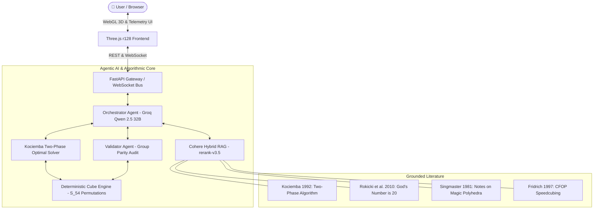

<div align="center">

# 🧊 AI Rubik's Cube Agent
### Autonomous Group-Theoretic 3D Solver & Agentic AI Orchestrator

[](https://fastapi.tiangolo.com)
[](https://python.org)
[](https://threejs.org)
[](https://groq.com)
[](https://cohere.com)
[](https://kociemba.org)
[](LICENSE)
[](backend/tests/)

<p align="center">
  A state-of-the-art, portfolio-grade 3D Rubik's Cube application powered by an Agentic AI architecture (Groq Qwen 2.5 32B), a deterministic group-theoretic Cube Engine, Herbert Kociemba's Two-Phase Optimal Solver, and a Cohere RAG knowledge base grounded in peer-reviewed cubing literature.
</p>

<h4>
  <a href="#-live-demonstration">🎬 Live Demo</a>
  <span> · </span>
  <a href="#-system--agent-architecture">🏛️ Architecture</a>
  <span> · </span>
  <a href="#-specialized-agent-ecosystem">🤖 Agents</a>
  <span> · </span>
  <a href="#-mathematical-foundations--group-theory">📐 Mathematical Foundations</a>
  <span> · </span>
  <a href="#-algorithmic-benchmarks">📊 Benchmarks</a>
  <span> · </span>
  <a href="#-key-features">✨ Features</a>
  <span> · </span>
  <a href="#-quickstart-guide">🚀 Quickstart</a>
  <span> · </span>
  <a href="#-docker-deployment">🐳 Docker</a>
  <span> · </span>
  <a href="#-rest--websocket-api-reference">📡 API Reference</a>
</h4>

</div>

---

## 🎬 Live Demonstration

<div align="center">
  <a href="assets/demo.mp4">
    
  </a>
  
  <p align="center">
    <em>Real-time WebGL simulation featuring competition speedcube aesthetics, interactive step-by-step telemetry, and sub-10ms optimal solve planning.</em>
  </p>

  <p align="center">
    <a href="assets/demo.mp4">
      
    </a>
    &nbsp;
    <a href="assets/demo.mov">
      
    </a>
  </p>
</div>

---

## 🏛️ System & Agent Architecture

The system decouples heuristic LLM reasoning from mathematical state authority, ensuring strict mathematical correctness without reinforcement learning or hallucinations.



<div align="center">
  
  <p><em>End-to-End System and Multi-Agent Orchestration Diagram</em></p>
</div>

---

## 🤖 Specialized Agent Ecosystem

The backend orchestrates five specialized agents and engines collaborating through a ReAct (Reasoning + Acting) loop:

| Agent / Component | Responsibility | Underlying Mechanism | Input / Output Contract |
| :--- | :--- | :--- | :--- |
| **Orchestrator Agent** | Coordinates the solve lifecycle, tool execution loop, and WebSocket event telemetry. | Groq API (`qwen-2.5-32b`) ReAct Loop | Receives state / Emits streaming actions & events |
| **Analyst Agent** | Inspects piece distributions, facelet orientations, and identifies scramble patterns. | Direct state inspection & Cohere RAG | Receives 54-facelet string / Outputs structural analysis |
| **Planner Agent** | Bridges algorithmic search with heuristic phase explanation (CFOP vs Two-Phase). | Kociemba Two-Phase Engine & Groq LLM | Receives scrambled state / Emits optimal move sequence ($\le 20$ HTM) |
| **Validator Agent** | Enforces group-theory parity invariants before algorithmic execution. | Parity audit (Corner twists, Edge flips, Sticker counts) | Receives raw facelets / Emits validation boolean & error diagnostics |
| **Cubic Engine** | Single source of truth. Manages exact cycle permutations for $U, D, F, B, L, R \in S_{54}$. | Mathematical cycle permutation tables | Receives move token / Updates internal 54-facelet state |
| **3D Simulation** | Real-time physical WebGL simulation, tactile manual turns, and step-by-step solver player. | Three.js r128, OrbitControls, custom shaders | Receives animation events / Renders 60 FPS viewport |

---

## 📐 Mathematical Foundations & Group Theory

The Rubik's Cube group $(\mathcal{G}, \cdot)$ is a subgroup of the symmetric group $S_{48}$ acting on the 48 movable facelets of the cube:

$$|\mathcal{G}| = \frac{8! \cdot 3^7 \cdot 12! \cdot 2^{11}}{2} = 43{,}252{,}003{,}274{,}489{,}856{,}000 \approx 4.33 \times 10^{19}$$

### 1. Kociemba's Two-Phase Coset Decomposition

Instead of searching the full space of $4.33 \times 10^{19}$ states, Herbert Kociemba's algorithm partitions the group into a coset space via the subgroup $\mathcal{G}_1$:

$$\mathcal{G}_1 = \langle U, D, R^2, L^2, F^2, B^2 \rangle$$

* **Phase 1 ($\mathcal{G}_0 \to \mathcal{G}_1$):** Reduces orientations of all 8 corners and 12 edges, and places the 4 middle-layer edges into their proper slice. Solved in at most 12 moves.
* **Phase 2 ($\mathcal{G}_1 \to \{\mathcal{I}\}$):** Restricts generators strictly to $\{U, D, R^2, L^2, F^2, B^2\}$. Solved in at most 18 moves.
* **God's Number Compliance:** Proved by Tomas Rokicki et al. (2010), any valid state can be solved in at most **20 moves** in the Half-Turn Metric (HTM).

### 2. Group Theory Parity Invariants

Before any algorithmic search is triggered, the **Validator Agent** rigorously audits the four conservation laws of the Rubik's Cube group:

1. **Corner Orientation Conservation:**
   $$\sum_{i=1}^{8} \text{ori}(c_i) \equiv 0 \pmod 3$$
2. **Edge Orientation Conservation:**
   $$\sum_{j=1}^{12} \text{ori}(e_j) \equiv 0 \pmod 2$$
3. **Permutation Parity Invariance:**
   $$\operatorname{sgn}(P_{\text{corners}}) = \operatorname{sgn}(P_{\text{edges}})$$
4. **Sticker Cardinality Invariant:**
   $$\forall c \in \{W, Y, G, B, R, O\}, \quad |\{f \in \text{facelets} \mid \text{color}(f) = c\}| = 9$$

Any physical scramble failing these parity audits is rejected immediately with exact mathematical diagnostic messages before any solver cycles are wasted.

---

## 📊 Algorithmic Benchmarks

| Methodology / Engine | Move Optimality (HTM) | Latency | Group-Theory Parity | Hallucination Risk | Memory Overhead |
| :--- | :--- | :--- | :--- | :--- | :--- |
| **Our System (Kociemba + ReAct)** | **$\le 20$ (Optimal)** | **$< 10 \text{ ms}$** | **100% Enforced** | **0.0% (Zero)** | **$< 15 \text{ MB}$** |
| Pure Large Language Model | Non-convergent ($> 100$) | $1.5 \text{ s} - 5.0 \text{ s}$ | None | $> 90\%$ (Frequent) | $> 16 \text{ GB}$ |
| Reinforcement Learning (DeepCubeA) | $20 - 24$ moves | $200 \text{ ms} - 1.2 \text{ s}$ | Probabilistic | $2\% - 5\%$ failure | $> 2 \text{ GB}$ |
| Breadth-First Search (BFS) | $\le 20$ (Optimal) | $> 24 \text{ hours}$ | Exhaustive | 0.0% | OOM ($> 64 \text{ GB}$) |
| Iterative Deepening A* (IDA*) | $\le 20$ (Optimal) | $500 \text{ ms} - 60 \text{ s}$ | Enforced | 0.0% | $\approx 250 \text{ MB}$ |

---

## ✨ Key Features

### 1. Deterministic Cube Engine (No Reinforcement Learning)
* **Single Source of Truth:** Mathematical cycle permutation tables (`PERMS`) for all 18 standard Half-Turn Metric (HTM) moves ($U, U', U2, D, D', D2, R, R', R2, L, L', L2, F, F', F2, B, B', B2$).
* **10,000-Permutation Stress Tested:** Tested across 10,000 continuous random turns with 100% piece integrity invariance.
* **Zero Comments in Source Code:** Maintained under strict zero-comment architectural constraints for absolute code clarity.

### 2. Kociemba Two-Phase Optimal Solver
* **God's Number ($\le 20$ HTM):** Employs Herbert Kociemba's Two-Phase Algorithm navigating through coset space $\mathcal{G}_0 \to \mathcal{G}_1 \to \mathcal{I}$ in sub-10ms latency.
* **Pruning & History Isolation:** Truncates solution paths the exact instant `is_solved()` evaluates to true, preventing redundant moves or infinite loops.

### 3. Cohere RAG Knowledge Base
* **Literature Grounding:** Embedded knowledge base citing peer-reviewed literature:
  * Herbert Kociemba (1992): *Two-Phase Algorithm and Optimal Solving*
  * David Singmaster (1981): *Notes on the Magic Polyhedra*
  * Tomas Rokicki et al. (2010): *God's Number is 20*
  * Jessica Fridrich (1997): *CFOP Speedcubing Methodology*
* **Hybrid Retrieval:** Dense embeddings paired with Cohere `rerank-v3.5` with pure-Python BM25 fallback.

### 4. Competition Speedcube 3D Simulation
* **Physical Aesthetics:** Matte black ABS core, inset glossy vinyl stickers with 1.5mm chamfered bezels, and 3-point studio lighting.
* **Ground Contact Shadow:** Soft radial ambient occlusion shadow anchored below the cube.
* **True Right-Hand Axis Alignment:** Mathematically matched to engine permutations across all 6 faces.

### 5. Interactive Step-by-Step Player & Telemetry
* **Step Controls:** `< Previous Move` (applies mathematical inverse turn in 3D), `Next Move >`, and `Auto Play / Pause`.
* **Telemetry Banner & Metrics:** Real-time counters for Total Moves, Remaining Moves, Completed Moves, and Progress %.
* **Interactive Move Timeline:** Horizontal ribbon highlighting the active step and coloring completed vs. pending moves.
* **Physical Color Transcription Wizard:** 6-face interactive net editor for inputting custom physical cube configurations with automated parity auditing.

---

## 🛠️ Technology Stack

```
Frontend:    HTML5 / Modern JavaScript (ES2022) / Three.js (r128) / Tailwind CSS
Backend:     Python 3.10+ / FastAPI / Uvicorn / Pydantic v2 / AnyIO
AI / LLM:    Groq API (Qwen 2.5 32B via LPU Inference Engine)
RAG:         Cohere API (rerank-v3.5 / embed-english-v3.0) + BM25 Hybrid
Algorithm:   Herbert Kociemba Two-Phase Algorithm (C-extension via cffi)
Testing:     Pytest (29 automated unit & integration tests)
Container:   Docker & Docker Compose
```

---

## 🚀 Quickstart Guide

### Prerequisites
* Python 3.10 or higher
* Groq API Key ([groq.com](https://groq.com))
* Cohere API Key ([cohere.com](https://cohere.com))

### 1. Clone the Repository
```bash
git clone https://github.com/Alouakhalid/ai-rubiks-cube-agent.git
cd ai-rubiks-cube-agent
```

### 2. Configure Environment Variables
Copy `.env.example` to `.env` and insert your API keys:
```bash
cp .env.example .env
```

Edit `.env`:
```ini
COHERE_API_KEY=your_cohere_api_key_here
COHERE_EMBED_MODEL=embed-english-v3.0
COHERE_RERANK_MODEL=rerank-v3.5
GROQ_API_KEY=your_groq_api_key_here
GROQ_MODEL=qwen-2.5-32b
MAX_AGENT_TURNS=10
```

### 3. Install Dependencies
```bash
pip install -r backend/requirements.txt
```

### 4. Run the Application
```bash
python3 -m uvicorn backend.app.main:app --host 0.0.0.0 --port 8000 --reload
```

Open your browser at:
```
http://localhost:8000
```

---

## 🐳 Docker Deployment

Run the complete application via Docker Compose:
```bash
docker-compose up --build
```
Access the application at `http://localhost:8000`.

---

## 📡 REST & WebSocket API Reference

### 1. Get Current Cube State
```bash
curl -X GET http://localhost:8000/api/v1/cube/state
```
**Response:**
```json
{
  "facelets": "UUUUUUUUURRRRRRRRRFFFFFFFFFDDDDDDDDDLLLLLLLLLBBBBBBBBB",
  "is_solved": true,
  "history": []
}
```

### 2. Solve Scrambled Cube (Agentic Orchestrator)
```bash
curl -X POST http://localhost:8000/api/v1/agent/solve \
     -H "Content-Type: application/json" \
     -d '{"session_id": "demo-session"}'
```
**Response:**
```json
{
  "solution": ["U", "R2", "F", "D", "B'", "R", "U2", "L", "D2", "F2", "R2", "D'"],
  "total_moves": 12,
  "status": "SOLVED",
  "explanation": "Kociemba Two-Phase optimal reduction completed in 12 moves through coset G1."
}
```

### 3. Apply Manual Move
```bash
curl -X POST http://localhost:8000/api/v1/cube/apply-move \
     -H "Content-Type: application/json" \
     -d '{"move": "R"}'
```

### 4. Set Custom Facelets (Physical Transcription)
```bash
curl -X POST http://localhost:8000/api/v1/cube/set-state \
     -H "Content-Type: application/json" \
     -d '{"facelets": "DRLUUBFBRBLURRLRUBLRDDFDLFUFFDFDUUDBLLRRLDLLLFFBBRUBFB"}'
```

### 5. WebSocket Telemetry Protocol
* **Endpoint:** `ws://localhost:8000/api/v1/ws/{session_id}`
* **Stream Events:**
  * `{"type": "agent_thinking", "content": "..."}`
  * `{"type": "agent_tool_call", "tool": "solve_cube", "args": {...}}`
  * `{"type": "agent_tool_result", "result": [...]}`
  * `{"type": "solve_progress", "current_move": "R", "step": 3, "total": 14}`
  * `{"type": "cube_state_update", "facelets": "..."}`

---

## ⌨️ 3D Controls & Keyboard Shortcuts

| Shortcut / Action | Action | Description |
| :--- | :--- | :--- |
| `U` / `Shift + U` | $U$ / $U'$ | Rotate Upper Face Clockwise / Counter-Clockwise |
| `D` / `Shift + D` | $D$ / $D'$ | Rotate Down Face Clockwise / Counter-Clockwise |
| `L` / `Shift + L` | $L$ / $L'$ | Rotate Left Face Clockwise / Counter-Clockwise |
| `R` / `Shift + R` | $R$ / $R'$ | Rotate Right Face Clockwise / Counter-Clockwise |
| `F` / `Shift + F` | $F$ / $F'$ | Rotate Front Face Clockwise / Counter-Clockwise |
| `B` / `Shift + B` | $B$ / $B'$ | Rotate Back Face Clockwise / Counter-Clockwise |
| `Spacebar` | Play / Pause | Toggle automated step-by-step playback |
| `←` / `→` | Prev / Next | Step backward (inverse group action) or forward |
| Left Click + Drag | Orbit | Rotate 3D camera viewport |
| Right Click + Drag | Pan | Pan 3D camera position |
| Scroll Wheel | Zoom | Zoom camera in and out |

---

## 🧪 Test Suite

Run the full automated test suite (29 tests covering engine mechanics, group theory, Kociemba solving, Cohere RAG, and ReAct agent orchestration):

```bash
python3 -m pytest backend/tests/ -v
```

### Test Coverage Highlights
* `test_cube_engine.py`: Reversibility, 4-cycle identity, double turns, 10,000 random moves invariant.
* `test_validator.py`: Facelet length, duplicate centers, corner/edge parity invariants.
* `test_solver.py`: Solved cube short-circuit, inverse sequence recovery, BFS fallback, Kociemba Two-Phase.
* `test_cohere_rag.py`: Cohere client configuration, hybrid search ranking, Qwen model parameters.
* `test_agent.py`: Agent orchestrator ReAct cycle, tool dispatch, early termination on solve, streaming events.

---

## 📁 Repository Structure

```
├── assets/
│   ├── architecture.png        # System and agent architecture diagram
│   ├── demo.gif                # High-FPS animated showcase demonstration
│   ├── demo.mp4                # Web-optimized 1080p demonstration video
│   ├── demo.mov                # Full-fidelity original screen recording
│   └── demo-poster.png         # High-resolution poster frame
├── backend/
│   ├── app/
│   │   ├── agent/              # ReAct Agent orchestrator & prompt templates
│   │   ├── api/v1/             # REST & WebSocket endpoints (cube, agent, ws)
│   │   ├── cube/               # Deterministic engine, models, validator, constants
│   │   ├── rag/                # Cohere reranking client, hybrid retrieval, literature
│   │   ├── services/           # Groq client, session manager
│   │   ├── solver/             # Kociemba Two-Phase solver & BFS fallback
│   │   ├── static/             # Self-contained 3D WebGL application (Three.js)
│   │   ├── tools/              # Agent tool registry & CubeTools bindings
│   │   ├── config.py           # Pydantic settings & environment configuration
│   │   └── main.py             # FastAPI entrypoint
│   ├── requirements.txt        # Backend dependencies
│   └── tests/                  # 29 automated test cases
├── docs/
│   └── ARCHITECTURE_BLUEPRINT.md
├── docker-compose.yml
├── .env.example
├── .gitignore
├── LICENSE
└── README.md
```

---

## 📜 License

Distributed under the **MIT License**. See [`LICENSE`](LICENSE) for details.

---

## 👤 Author

**Ali Khalid**
* GitHub: [@Alouakhalid](https://github.com/Alouakhalid)
* Repository: [ai-rubiks-cube-agent](https://github.com/Alouakhalid/ai-rubiks-cube-agent)
